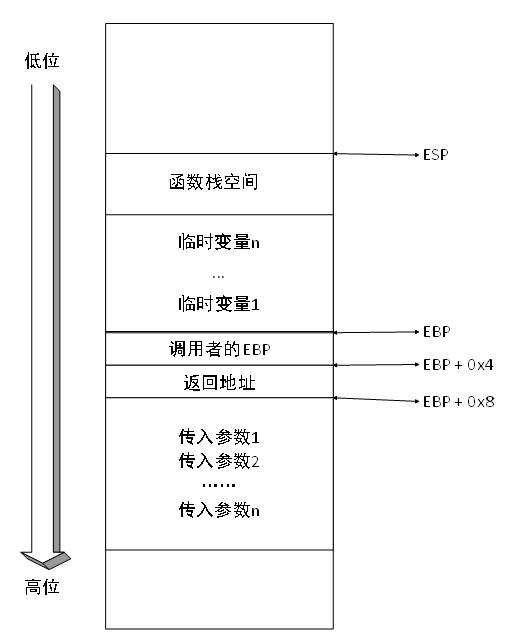

#C++基础系列---函数
##第1章引言
函数作为执行语句的集合，在程序语言中发挥着重要作用。
本文将介绍函数的基本处理流程、传入参数、临时变量和返回机制来解释C++的函数基础。在程序运行过程中，通过监控内存的变化，来解释运行时态时的函数行为。并从普通函数延伸到类函数，介绍C++的多态特性的实现基础。
在解释基础语法时，本文会运用到较多的汇编语言（VS2010 Debug环境）。
##第2章程序内存存储区
内存存储区用于存放程序的数据以及执行代码。C++的内存存储区分为以下5种。
###2.1. 栈区
栈区在程序运行时编译器自动分配，用于存放函数的参数、临时变量、函数栈指针、函数返回地址等。栈区，由编译器负责维护，程序结束时，由编译器释放。
###2.2. 堆区
堆区在程序运行时，由代码分配释放。
###2.3. 全局区
全局区由编译器维护，存放未初始化的全局变量和静态变量
###2.4. 常量区
顾名思义用于存放程序中的常量。
###2.5. 代码区
存放函数体的二进制代码。
其中，以上几个存储区，只有堆是程序员可以直接操作分配的。

##第3章函数

###3.1. 函数的基本流程
函数的基本流程分为以下6步：

1. 保存调用前状态，主要是保存了函数栈指针ebp，ebp是什么后面再仔细介绍，主要是用来为函数的栈空间分边界的。
除了ebp，函数还保存了这三个寄存器ebx、esi和edi。

2. 分配临时空间，程序为函数中的临时变量分配默认大小（0xC0）的临时空间。

3. 为第二步刚分配的临时空间赋上初始值0x CCCCCCCCh。当代码中一些临时变量没有赋初值的时候，默认的值就会采用这个初始值。

4. 程序员的代码，这里开始执行程序员在这个函数写的代码。如果是一个空函数，这一步是没有执行指令的。

5. 恢复调用前的状态，恢复几个寄存器ebx、esi、edi和两个函数栈指针ebp和esp。这里的esp就是栈顶指针，是相对于ebp栈底指针来说的。

6. 返回调用处代码。

为了说明上面六个基本处理流程，我们这里选取一个空函数的汇编指令来进行实例说明：
函数原型：
<pre><code>void fun(){}</code></pre>
调用：
<pre><code>fun();</code></pre>
fun();在编译时，会使用call fun address替换，这里fun();会变成如下代码：
<pre><code>01302CFE call fun (13011D1h)</code></pre>
0x13011D1h处的代码如下
<pre><code>013011D1 jmp fun1 (13017C0h)</code></pre>
接着前往位置0x13017C0h处，便是函数fun代码段。为了方便的说明每一行的指令，说明通过程序代码的注释方式，跟在每一句指令后面。

<pre><code>void fun()
{
013017C0 push ebp  //第一步：保存ebp ebp和esp是一对栈指针
//其中ebp是栈底指针，esp是栈顶指针
013017C1 mov ebp,esp   //ebp = esp
013017C3 sub esp,0C0h   //第二步：在栈上分配0xC0大小的临时空间
013017C9 push ebx  //保存ebx
013017CA push esi   //保存esi
013017CB push edi   //保存edi
013017CC lea edi,[ebp-0C0h] //读入[ebp - 0c0h]的有效地址;
//就是刚分配
013017D2 mov ecx,30h //第三步0x30改ecx，就是下面的循环次数
013017D7 mov eax,0CCCCCCCCh  //将0CCCCCCCCh赋给eax 
013017DC rep stos dword ptr es:[edi]  
// rep便是重复执行，每执行一次ecx便减小1，知道为0停止循环
//stos 将eax的值拷贝到es:[edi]所指向的地址
//最后就是填满了临时存储区
}
013017DE pop edi//第五步，返回edi
013017DF pop esi//返回esi
013017E0 pop ebx//返回ebx
013017E1 mov esp,ebp //将此函数的ebp赋给esp，恢复至调用前的状态
013017E3 pop ebp//重新获得调用此函数前的ebp
013017E4 ret//第六步，返回
</code></pre>

###3.2. 函数的临时变量
众所周知，函数的临时变量存放在栈。这是每一个程序员都知道一个常识，那么这些变量是在栈中如何存放的？这里我们会针对临时变量来介绍C++处理临时变量的方法。
针对3.1中的简单函数，进行如下改编：
函数 void fun2(){int i = 0;}。直接展开汇编指令，为了不赘述，这里我会去除函数处理的基本流程指令，用…代替。

<pre><code>void fun2()
{
int i = 0;
012A180E mov dword ptr [i],0 //将0赋值给i所指向的地方，这个i的位置是ebp-4的位置
}</code></pre>

由于直接使用VS2010查看的汇编指令，无法清晰的说明临时变量的存放方式，我这边使用IDA反编译生成的汇编代码进行解释。
<pre><code>...
.text:004117F0 ; void __cdecl fun2()         //这里__cdecl是函数的调用方式
//这里不做解释了
.text:004117F0 ?fun2@@YAXXZ proc near ; CODE XREF: fun2(void)j
.text:004117F0
.text:004117F0 var_CC = byte ptr -0CCh      //这里是栈临时区的大小，byte ptr是类型

.text:004117F0 i = dword ptr -8       //i = -8 ,dowrd ptr是类型
.text:004117F0
…
.text:0041180E mov [ebp+i], 0      //ebp + i = ebp – 8
                               //其实这个变量的存放位置ebp和ebp- 0CCh之间
.text:00411815 pop edi           //与VS2010中类似，略
.text:00411816 pop esi            //与VS2010中类似，略
…</code></pre>

从内存监控我们来看一下这个临时变量。为了方便
解了函数的临时变量后，我们进一步来了解函数的传入参数。调用者是如何将函数传入至函数，函数又是如何获取到这些参数的呢？

###3.3. 函数的传入参数
了解了函数的临时变量后，我们进一步来了解函数的传入参数。调用者是如何将函数传入至函数，函数又是如何获取到这些参数的呢？
这里我们会针对这个问题，来展开讨论。
首先我们使用以下函数：
<pre><code>void fun3(int x)
{
x += 1;
}</code></pre>
调用：fun3(10);
首先先来看调用处的汇编指令。
<pre><code>012A2D08 push 0Ah              //将参数0xA压入栈
012A2D0A call fun3 (12A11CCh)    //调用fun3
012A2D0F add esp,4             //平衡栈，这句代码是否出现，还要看函数的调用方式</code></pre>
去除基本流程指令，展开函数段：
<pre><code>void fun3(int x)
{
...
x += 1;
012A205E mov eax,dword ptr [x]     //将参数x的值赋给eax
//x的位置在ebp-4
012A2061 add eax,1               //等价于eax = eax + 1
012A2064 mov dword ptr [x],eax     //等价于x = eax
}
....</code></pre>
由于与3.2章节中同样的原因，我们还是使用IDA中的代码再一次分析。
<pre><code>…
.text:00412040 x = dword ptr 8 
…
.text:0041205E mov eax, [ebp+x] 
.text:00412061 add eax, 1 
.text:00412064 mov [ebp+x], eax 
…</code></pre>
我们发现，变量x处于ebp+8处，我们这里解释这些变量的存放位置，主要是对函数栈空间有一个认识。
###3.4. 函数的返回
接下来就是函数的返回值的问题。一样的分析方法：
<pre><code>int fun5(int x,int y)
{
int z = x+ y;
return z;
}</code></pre>
调用：
<pre><code>int z = fun5(30,40);</code></pre>
去除公共代码后展开 ：
<pre><code>012A2D1E push 28h             //压入参数0x28，就是fun5(30,40)中的40
012A2D20 push 1Eh             //压入参数0x1E，就是fun5(30,40)中的30
                             //这里参数压入栈的方式也是和调用方式有关， 
//这里C++使用的是__stdcall，压栈是从右往左
012A2D22 call fun5 (12A11C7h)   //调用fun5
012A2D27 add esp,8            //平衡栈
012A2D2A mov dword ptr [z],eax  //函数的返回值在eax寄存中
</code></pre>
看一下fun3内部的汇编。之后没有特殊说明，函数的公共汇编代码都会去掉用…替代
<pre><code>
int fun5(int x,int y)
{
...
int z = x+ y;
012A267E mov eax,dword ptr [x]   //将参数x赋给eax
012A2681 add eax,dword ptr [y]    //将y和eax相加，相当于eax = eax + y
012A2684 mov dword ptr [z],eax   //相当于z = eax
return z;
012A2687 mov eax,dword ptr [z]  //将z赋给eax，函数的返回值是靠eax寄存器传递的
}
...
</code></pre>
##第4章	函数的栈空间
我们直接来看下面的栈空间图：

图1 栈空间图

函数栈中，我们ESP和EBP来划分函数的栈空间，EBP表示底，ESP表示顶部。这样函数的栈空间便是这两个指针之间区域。

这个区域主要是放函数的临时变量。

我们在EBP往下看，其实是内存的高位。EBP+0x4处存放的是Old EBP。其实也是比较好理解的，这个就是函数调用者的EBP。也就是说如果函数fun1中调用了fun2函数，那么这个地方保存的就是fun1的EBP。

再往下看，EBP+0x8的地方放的是一个返回地址，也就是函数调用完成之后，返回到调用处的代码，接着往下执行。

接着往下看，便是一些传入参数存放的位置。我们可以回忆，调用函数的时候，首先我们把参数压入栈，就是这个操作吧函数的传入参数放在了这个位置。

对于此图会在另一篇文章中介绍它的由来。

##第5章	小结
关于函数，其实还有函数的调用方式以及类函数等，限于篇幅，这里不再介绍，C++基础系列的文章中在进行介绍。
这一篇是对C++基础系列第一篇也是之后文章的基础。今后的文章都会以此篇为基础，详细讲解C++的特性原理。

December 23, 2016 10:10 AM
